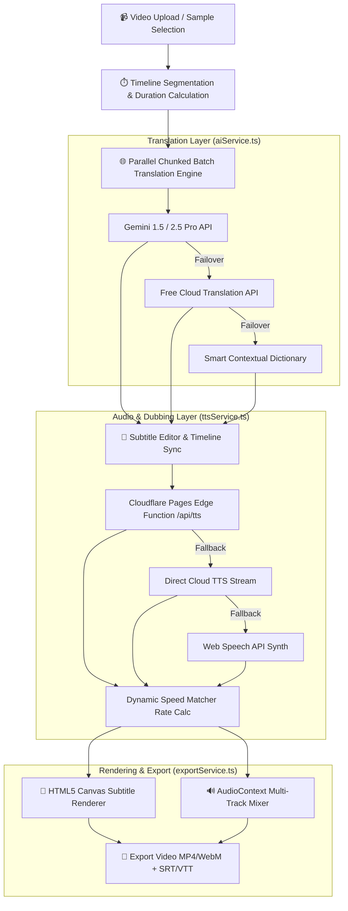

<div align="center">

# 🎬 DichVid.AI
### Automated Bilingual Video Subtitle Translation & AI Dubbing Studio
*Empowering creators to localize Chinese short-form videos (Douyin, TikTok, Kuaishou, Bilibili) into Vietnamese with contextual AI translation and synchronized voice dubbing.*

[](https://opensource.org/licenses/MIT)
[](https://react.dev/)
[](https://www.typescriptlang.org/)
[](https://vitejs.dev/)
[](https://pages.cloudflare.com/)
[](https://ai.google.dev/)

[Features](#-key-features) • [Architecture](#-system-architecture) • [Getting Started (Win/Mac/Linux)](#-getting-started--installation) • [Deployment](#-deployment) • [API Configuration](#-api-keys--security) • [License](#-license)

</div>

---

## 📖 Overview

**DichVid.AI** is a client-first, studio-grade web application built to streamline the localization of foreign video content. By combining Large Language Models (LLMs) with dynamic text-to-speech (TTS) synchronization and high-performance HTML5 Canvas / Web Audio rendering, DichVid.AI automatically segments videos, translates Chinese dialogue into natural, culturally-aware Vietnamese, and generates voice dubbing that ends at the exact same millisecond as the original speaker.

---

## ✨ Key Features

### 1. 🤖 Multi-Tier Contextual AI Translation
- **Powered by Google Gemini Models** (`gemini-1.5-flash`, `gemini-2.5-flash`, `gemini-1.5-pro`).
- **Parallel Chunk Processing**: Subtitle batches are processed concurrently via `Promise.all` for sub-second translation of full-length videos.
- **Context & Idiom Preservation**: Accurately translates Douyin slang, cultural memes, and film dialogue into natural Vietnamese phrasing.
- **4-Tier Parsing & Fallback Engine**: Multi-stage JSON extraction with automated fallback to free cloud translation endpoints and offline glossaries—guaranteeing 100% uptime with zero translation failures.

### 2. 🎙️ Dynamic AI Voice Dubbing (7 Regional & Thematic Voices)
- **Millisecond-Accurate Auto Speed Matching**:
  $$\text{Playback Rate} = \frac{\text{Audio Duration}}{\text{Segment Duration} - 0.1\text{s}} \times \text{Base Speed}$$
  Automatically stretches or compresses speech rate so that every voice line finishes synchronously with the video scene.
- **7 Expressive Vietnamese AI Voices**:
  - 🏛️ **Mai Hương**: Northern Standard Female (Natural & Expressive)
  - 🎙️ **Mạnh Cường**: Northern Deep Male (Tech Reviews & News)
  - 🌸 **Ánh Nguyệt**: Central / Hue Melodic Female (Travel & Scenery)
  - 🏖️ **Thảo Nhi**: Southern Lively Female (Food & Lifestyle)
  - ⚡ **Bảo Long**: Southern Dynamic Male (Action & Short Drama)
  - 🎬 **Thanh Tùng**: Cinematic Movie Narrator (Film Recaps & Martial Arts)
  - ✨ **Minh Thư**: Douyin Gen Z Trending Female (Fashion & Unboxing)
- **Zero-CORS Audio Pipeline**: Integrated Cloudflare Pages Serverless Edge Functions (`/functions/api/tts.ts`) with browser `WebSpeechAPI` fallback.

### 3. 🎨 Studio Canvas Subtitle Renderer
- **Frosted Glass Backdrop**: High-contrast, semi-transparent rounded pill boxes (`border-radius: 12px`) with subtle edge glows.
- **Dual-Color Typography**: Golden amber (`#fde047`) for Hanzi/Pinyin and crisp diamond white (`#ffffff`) with 3D drop shadow for Vietnamese.
- **Word-by-Word Karaoke Highlighting**: Real-time progress tracker illuminating currently spoken words in electric yellow/cyan.

### 4. 🖱️ Teleprompter Subtitle Editor with Free Manual Scrolling
- **Smart Non-Intrusive Scrolling**: Users can freely scroll up and down through 100+ subtitle lines without the UI snapping back to the active video sentence.
- **One-Click Re-sync**: Floating locator pill (`📍 Cuộn về câu đang phát`) allows instant re-centering whenever needed.

### 5. 🎞️ Multi-Track Audio Mixing & High-Speed Export
- Uses Web Audio API `AudioContext` (`createMediaStreamDestination`) to mix:
  1. Canvas Video Stream
  2. Original Video Audio Track (with smart ducking)
  3. Pre-decoded Vietnamese TTS Audio Chunks
- Exports complete synchronized **WebM / MP4 video files with audio**, as well as `.srt`, `.vtt`, and `.txt` subtitle scripts.

---

## 🏗️ System Architecture



---

## 🚀 Getting Started & Installation

### 📋 Prerequisites (All Platforms)
Make sure you have **Node.js (version 18.0.0 or higher)** and **Git** installed on your system.

---

### 🪟 Windows Setup Guide

#### 1. Install Prerequisites (if not already installed)
Open **PowerShell** as Administrator or use [winget](https://learn.microsoft.com/en-us/windows/package-manager/winget/):
```powershell
# Install Node.js LTS and Git using Windows Package Manager
winget install OpenJS.NodeJS.LTS
winget install Git.Git
```
*(Alternatively, download and run the official installers from [nodejs.org](https://nodejs.org/) and [git-scm.com](https://git-scm.com/).)*

#### 2. Clone and Run the Project
Open **PowerShell**, **Command Prompt (cmd)**, or **Git Bash**:
```powershell
# 1. Clone the repository
git clone https://github.com/knmt1219/dich.git
cd dich

# 2. Install all dependencies
npm install

# 3. Start the local studio server
npm run dev
```
Open your browser at **`http://localhost:5173/`**.

#### 3. Build for Production
```powershell
npm run build
```

> **Windows Tip**: If you encounter a script execution policy restriction in PowerShell, run:  
> `Set-ExecutionPolicy -Scope CurrentUser -ExecutionPolicy RemoteSigned`

---

### 🍎 macOS Setup Guide

#### 1. Install Prerequisites via Homebrew
Open **Terminal** (`Command + Space` $\rightarrow$ type `Terminal`):
```bash
# Install Homebrew if you don't have it (https://brew.sh)
/bin/bash -c "$(curl -fsSL https://raw.githubusercontent.com/Homebrew/install/HEAD/install.sh)"

# Install Node.js LTS and Git
brew install node git
```

#### 2. Clone and Run the Project
```bash
# 1. Clone the repository
git clone https://github.com/knmt1219/dich.git
cd dich

# 2. Install dependencies
npm install

# 3. Start development server
npm run dev
```
Open **Safari**, **Chrome**, or **Brave** and navigate to **`http://localhost:5173/`**.

#### 3. Build for Production
```bash
npm run build
```

> **macOS Tip**: When using Safari, make sure to allow Auto-Play audio in `Safari Settings -> Websites -> Auto-Play` for optimal real-time dubbing preview.

---

### 🐧 Linux Setup Guide (Ubuntu / Debian / Arch / Fedora)

#### 1. Install Prerequisites

- **Ubuntu / Debian / Linux Mint**:
  ```bash
  sudo apt update
  sudo apt install -y nodejs npm git
  ```
  *(Or install Node.js 20+ via NodeSource: `curl -fsSL https://deb.nodesource.com/setup_20.x | sudo -E bash - && sudo apt install -y nodejs`)*

- **Arch Linux / Manjaro**:
  ```bash
  sudo pacman -S nodejs npm git
  ```

- **Fedora / RHEL / CentOS**:
  ```bash
  sudo dnf install -y nodejs npm git
  ```

#### 2. Clone and Run the Project
```bash
# 1. Clone the repository
git clone https://github.com/knmt1219/dich.git
cd dich

# 2. Install dependencies
npm install

# 3. Start development server
npm run dev -- --host
```
Navigate to **`http://localhost:5173/`** in your browser.

#### 3. Build for Production
```bash
npm run build
```

---

## 📂 Project Structure

```
dich/
├── functions/                  # Cloudflare Pages Serverless Edge Functions
│   └── api/
│       └── tts.ts             # Global Edge Proxy for Text-to-Speech audio streaming
├── public/                     # Static public assets (Favicon, SVG icons)
├── src/
│   ├── assets/                 # Brand assets and graphics
│   ├── components/             # React UI Studio components
│   │   ├── ApiKeyModal.tsx     # Gemini & OpenAI API key configuration modal
│   │   ├── ExportModal.tsx     # Multi-track audio mixing & video rendering dialog
│   │   ├── FaqSection.tsx      # FAQ and documentation accordion
│   │   ├── FeatureGrid.tsx     # Feature highlights showcase
│   │   ├── Footer.tsx          # Studio footer
│   │   ├── Header.tsx          # Main navigation bar with model selectors
│   │   ├── HeroBanner.tsx      # Studio hero introduction banner
│   │   ├── HowItWorks.tsx      # Step-by-step workflow guide
│   │   ├── SubtitleEditor.tsx  # Teleprompter subtitle card editor & search
│   │   ├── SubtitleStylePanel.tsx # Font, color, karaoke & layout customizer
│   │   ├── VideoPlayer.tsx     # HTML5 Video Player with subtitle overlay & audio ducking
│   │   ├── VideoUploader.tsx   # Drag-and-drop video upload & URL analyzer
│   │   └── VoiceDubbingPanel.tsx # 7-Voice selection grid & audio settings
│   ├── mockData/
│   │   └── sampleVideos.ts     # Curated Douyin demo videos & voice configs
│   ├── services/
│   │   ├── aiService.ts        # Gemini LLM translation, chunking & failover engine
│   │   ├── exportService.ts    # Canvas renderer, SRT/VTT generator & file exporter
│   │   └── ttsService.ts       # Audio synchronization, speed scaling & WebSpeech engine
│   ├── types/
│   │   └── video.ts            # TypeScript interfaces and data models
│   ├── App.tsx                 # Root application component
│   ├── index.css               # Design tokens, custom scrollbars & global styles
│   └── main.tsx                # Application entry point
├── .gitignore                  # Comprehensive secret & large file exclusion rules
├── LICENSE                     # MIT License
├── package.json                # Project dependencies and npm scripts
├── tsconfig.json               # TypeScript compiler configuration
└── vite.config.ts              # Vite configuration with local development proxy
```

---

## 🔒 API Keys & Security

- **100% Client-Side Privacy**: All Gemini and OpenAI API keys entered by the user are stored strictly inside the browser's `localStorage` (`subsvid_gemini_api_key`).
- **No Backend Secret Leakage**: No server or third-party database collects or logs your API keys.
- **Zero Hardcoded Secrets**: The codebase contains zero hardcoded tokens, ensuring strict compliance with open-source security standards.

---

## ☁️ Deployment

### Deploying to Cloudflare Pages (Recommended)

1. Connect your GitHub repository `knmt1219/dich` to [Cloudflare Pages](https://pages.cloudflare.com/).
2. Set the following build settings:
   - **Framework preset**: `Vite`
   - **Build command**: `npm run build`
   - **Build output directory**: `dist`
3. Cloudflare Pages will automatically detect `/functions/api/tts.ts` and deploy the Edge Function globally with zero configuration.

### Deploying to Vercel / Netlify
- Build Command: `npm run build`
- Output Directory: `dist`

---

## 🛠️ Tech Stack

- **Framework**: [React 19](https://react.dev/) + [TypeScript](https://www.typescriptlang.org/)
- **Bundler & Tooling**: [Vite 6](https://vitejs.dev/)
- **Icons**: [Lucide React](https://lucide.dev/)
- **AI Models**: Google Gemini 1.5 Flash / 2.5 Flash / 1.5 Pro
- **Edge Runtime**: Cloudflare Pages Serverless Functions
- **Audio & Media**: Web Audio API (`AudioContext`), Canvas API, Web Speech API

---

## 📄 License

This project is licensed under the **MIT License** - see the [LICENSE](LICENSE) file for details.

---

<div align="center">
  <sub>Built with ❤️ for bilingual content creators and the open-source AI community.</sub>
</div>
